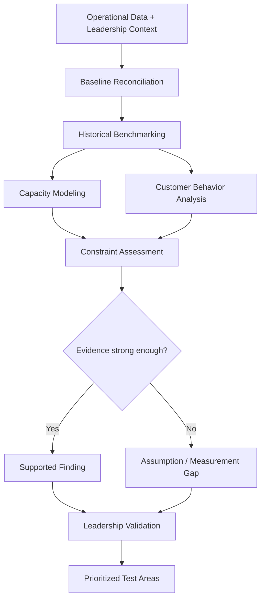

# Small Business Growth Diagnostic

A sanitized decision-support case showing how I turn operational data, capacity constraints, customer behavior, and business assumptions into a structured growth diagnosis.

This repository is based on real consulting work for a small appointment-based service business. Client-identifying details and raw records are excluded. The analytical structure is real; the public examples are sanitized or synthetic unless explicitly labeled as verified findings.

## The business problem

The client had an ambitious monthly appointment target and several plausible explanations for why growth had stalled: staffing, advertising, the website, the booking platform, or customer retention.

The risk was moving directly into tactics before establishing which constraints were actually supported by the evidence.

I structured the work around a different question:

> What is limiting sustainable appointment growth, what is only assumed, and what should leadership validate before investing in solutions?

## What the diagnostic does

The analysis separates the problem into five layers:

1. Establish a trustworthy operating baseline
2. Compare the baseline with demonstrated historical performance and the stretch target
3. Model capacity under explicit staffing assumptions
4. Examine customer retention and repeat behavior
5. Separate supported constraints from unproven explanations, then define the next decision

This keeps a target from becoming a strategy by itself.

## Verified findings from the underlying project

These figures come from the client analysis and are included because they are already part of the verified project record:

- **393.2 accepted appointments/month** — H1 2026 working baseline, calculated from 2,359 accepted appointments across six months
- **596 accepted appointments** — historical monthly high in March 2025
- **660 appointments/month** — owner-stated stretch benchmark; useful as a reference point, but not independently validated as the correct operating target
- **~804 service hours/month** — modeled requirement for 660 appointments using an average appointment duration of about 73.1 minutes
- **10 active service providers** in the staffing snapshot used for the capacity model
- modeled capacity ranged from roughly **572 to 1,455 productive hours/month**, depending on recurring weekly coverage assumptions
- **19.8%** of eligible first-observed customers returned within 90 days in the analyzed customer history

Important qualification: accepted appointments were used as a working proxy and are **not the same as verified completed appointments**. Capacity figures are modeled estimates, not forecasts.

## The core conclusion

The analysis did **not** support a single-cause story.

Raw headcount was not proven to be the primary constraint. More advertising could create demand, but advertising was not proven to be the missing solution. Booking-path measurement was incomplete, so conversion was under-measured rather than proven broken. Operational issues existed in the booking system, but replacing the platform was not justified as the first intervention.

The stronger conclusion was that growth depended on the **whole operating system**: demand, retention, booking conversion, service-compatible capacity, and economics.

## What to inspect first

If you are reviewing this as a hiring manager, start here:

1. [Diagnostic architecture](docs/architecture.md) — how evidence moves from raw operating data to a decision
2. [Diagnostic framework](docs/diagnostic-framework.md) — the questions used to separate signal from assumption
3. [Evidence boundary](docs/evidence-boundary.md) — what is verified, modeled, directional, or intentionally withheld
4. [Assumptions and limitations](docs/assumptions-and-limitations.md) — where the analysis deliberately stops short of certainty
5. [Synthetic baseline example](examples/synthetic-baseline.md) — a simplified public-safe example of the calculation logic
6. [Synthetic decision summary](examples/synthetic-decision-summary.md) — how findings become leadership-ready choices

## Diagnostic architecture



The important feature is the decision gate: a plausible explanation does not become a recommendation unless the evidence supports it.

## Growth framework

The resulting growth system used four connected motions:

- **Attract** — new-customer demand generation
- **Keep** — repeat visits, rebooking, and lapsed-customer reactivation
- **Amplify** — referrals and booking-conversion improvement
- **Align + measure** — capacity, utilization, and economics

The framework is conceptual. It is **not** an additive formula or a forecast.

## What I owned

My role was to organize ambiguous business questions into a decision-ready diagnostic. That included reconciling operating data, defining baselines and caveats, modeling staffing capacity, interpreting customer-behavior patterns, pressure-testing common explanations, and translating the analysis into a leadership discussion about what to validate next.

The work was designed to reduce premature solutioning. Instead of asking which tactic to launch first, the diagnostic asked what the business could support, where the evidence was weak, and which assumptions needed testing.

## Repository map

```text
small-business-growth-diagnostic/
├── README.md
├── docs/
│   ├── architecture.md
│   ├── diagnostic-framework.md
│   ├── evidence-boundary.md
│   └── assumptions-and-limitations.md
└── examples/
    ├── synthetic-baseline.md
    ├── synthetic-capacity-scenario.md
    ├── synthetic-retention-snapshot.md
    └── synthetic-decision-summary.md
```

## Why there is no code here

The hiring signal in this project is analytical judgment, not software engineering. The important work is defining the right baseline, making assumptions visible, distinguishing modeled estimates from observed facts, and turning imperfect data into a responsible next decision.

Adding code would not materially improve that signal in this version.

## Privacy and evidence note

No customer names, appointment-level records, confidential client files, internal screenshots, credentials, or proprietary datasets are published here. Public examples are intentionally simplified and sanitized.

The project demonstrates the diagnostic method without exposing the client’s private operating data.