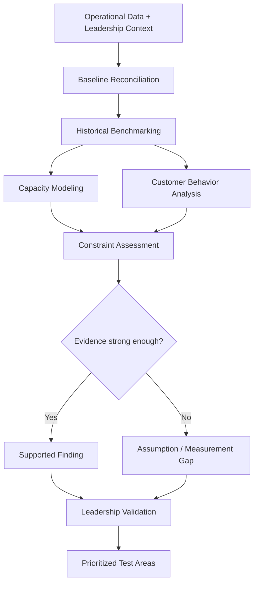

# Diagnostic Architecture

The diagnostic is designed to prevent a business target or a plausible explanation from becoming a recommendation too early.

## Why this structure

The work separates observed facts, modeled estimates, and open questions before strategy begins.

That matters because small businesses often have several reasonable explanations for the same performance problem. A capacity issue can look like a marketing issue. A measurement gap can look like a conversion problem. A stretch target can quietly become a planning assumption without being validated.

## Decision gate

A finding advances only when the evidence is strong enough to support it.

When the evidence is weak or incomplete, the output is not a confident recommendation. It becomes a measurement gap, assumption, or validation question for leadership.